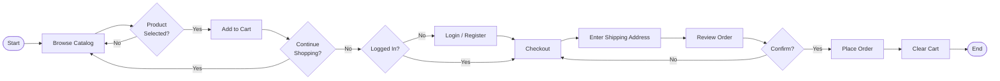
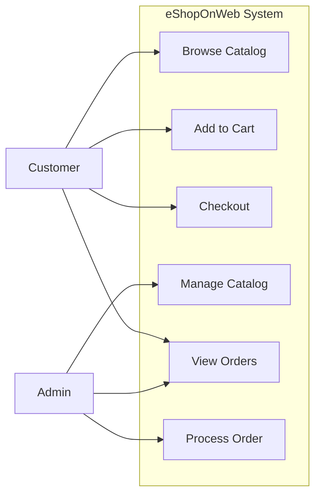
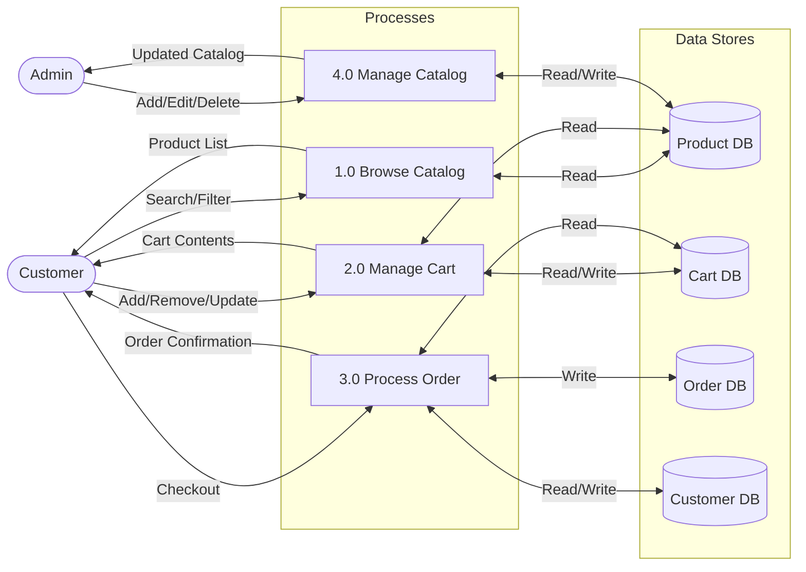
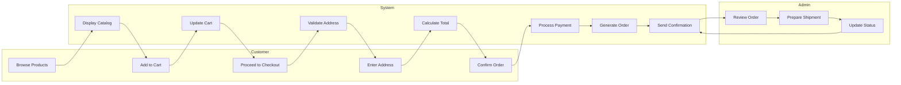
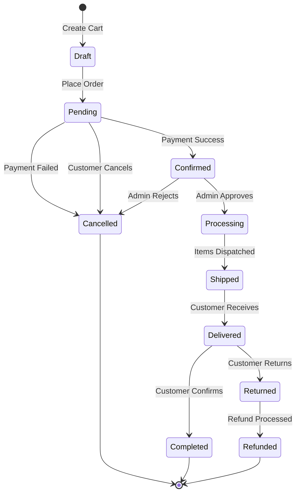
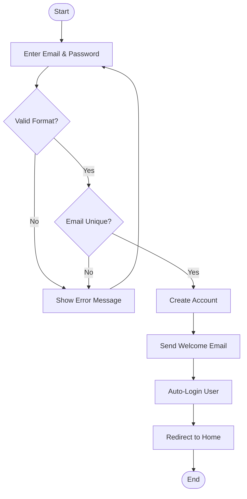

# Week 2 — Process Modeling & Tools

## Research: Key BA Elements & Their Interconnections

### 1. Capabilities

**Definition:** What the business is able to do — high-level abilities that enable value delivery.

**Example for eShopOnWeb:**

| Capability | Description | Business Value |
| --- | --- | --- |
| Product Catalog Management | Ability to maintain and display products | Enables sales |
| Order Processing | Ability to receive and fulfill customer orders | Generates revenue |
| Customer Account Management | Ability to register and authenticate users | Enables personalization |
| Cart Management | Ability to collect and modify purchase intent | Increases conversion |

### 2. Business Processes (Three Levels)

| Level | Name | Description | Example |
| --- | --- | --- | --- |
| L1 | Process Area | Broad functional area | "Order-to-Cash" |
| L2 | Process Group | Major steps within area | "Place Order", "Process Payment", "Fulfill Order" |
| L3 | Process Step | Detailed task/activity | "Validate shipping address", "Calculate order total", "Save order to database" |

### 3. User Personas

| Persona | Role | Goals | Pain Points |
| --- | --- | --- | --- |
| Sarah Shopper | Regular customer | Find products quickly, easy checkout | Confusing navigation, long forms |
| Mike Manager | Store admin | Keep catalog updated, monitor orders | No bulk edit, no reporting |
| Tom Techie | Developer | Clean code, easy to extend | Poor documentation, tight coupling |

### 4. User Stories → Requirements Mapping

User Stories (user perspective) decompose into Functional Requirements (system perspective), which trace to Non-Functional Requirements (quality perspective).

```javascript
User Story: "As a customer, I want to add items to cart"
    ↓
Functional Requirement: "System shall allow adding items to cart with quantity validation"
    ↓
Non-Functional Requirement: "Cart update response time < 500ms"
```

---

## Diagram Examples & Explanations

---

### 1. BPMN Diagram — "Customer Purchase Flow"

**Explanation:** BPMN (Business Process Model and Notation) uses standardized symbols to model business processes. It shows who does what, in what order, with decision points.

**Mermaid Code (copy to https://mermaid.live/):**



---

### 2. Use Case Diagram

**Explanation:** Shows actors (users/roles) and their interactions with system functions (use cases). Lines connect actors to the actions they can perform.

**Mermaid Code:**



---

### 3. Entity-Relationship (ER) Diagram

**Explanation:** Shows data entities, their attributes, and relationships between them. Cardinality (1:1, 1:N, M:N) defines how entities relate.

**Entities & Relationships:**

| Entity | Key Attributes | Relationships |
| --- | --- | --- |
| **Customer** | CustomerID, Email, PasswordHash, Name | 1:N → Order, 1:N → CartItem |
| **Product** | ProductID, Name, Price, Description, CategoryID | N:1 → Category, 1:N → OrderItem |
| **Category** | CategoryID, Name, Description | 1:N → Product |
| **Order** | OrderID, CustomerID, OrderDate, TotalAmount, Status | N:1 → Customer, 1:N → OrderItem |
| **OrderItem** | OrderItemID, OrderID, ProductID, Quantity, UnitPrice | N:1 → Order, N:1 → Product |
| **CartItem** | CartItemID, CustomerID, ProductID, Quantity | N:1 → Customer, N:1 → Product |

**Cardinality Summary:**

- Customer (1) ——— (N) Order
- Customer (1) ——— (N) CartItem
- Category (1) ——— (N) Product
- Order (1) ——— (N) OrderItem
- Product (1) ——— (N) OrderItem
- Product (1) ——— (N) CartItem

---

### 4. Data Flow Diagram (DFD) — Level 1

**Explanation:** DFD shows how data moves between processes, data stores, and external entities. Level 0 is context; Level 1 breaks down main processes.

**Mermaid Code:**



---

### 5. Wireframe / Mockup — Product Detail Page

**Explanation:** Low-fidelity sketch of a screen layout showing UI elements and their placement. No colors or graphics — just structure.

```javascript
+--------------------------------------------------+
|  [Logo]    Search... [🔍]    Cart(2)  [Account]  |
+--------------------------------------------------+
|  Home > Electronics > Smartphones > iPhone 15    |
+--------------------------------------------------+
|                                                  |
|   +------------------+   +---------------------+ |
|   |                  |   | iPhone 15           | |
|   |   [Product       |   | $999.00             | |
|   |    Image]        |   | ⭐⭐⭐⭐⭐ (128 reviews)| |
|   |                  |   |                     | |
|   |                  |   | Color: [Black][White]| |
|   |                  |   |                     | |
|   |                  |   | Qty: [-] 1 [+]      | |
|   |                  |   |                     | |
|   |                  |   | [Add to Cart]       | |
|   |                  |   | [Buy Now]           | |
|   +------------------+   +---------------------+ |
|                                                  |
|   Description                                    |
|   The latest iPhone with A17 Pro chip...        |
|                                                  |
+--------------------------------------------------+
|  [Related Products]                              |
|  [Item 1]  [Item 2]  [Item 3]  [Item 4]        |
+--------------------------------------------------+
```

---

### 6. Swimlane Diagram — "Order Placement Process"

**Explanation:** Shows cross-functional flow — each "lane" represents a different role/department. Activities are placed in the lane of the responsible party.

**Mermaid Code:**



---

### 7. Gantt Chart — Sprint Timeline

**Explanation:** Shows project tasks against a timeline. Bars represent duration; dependencies show sequence.

| Task | Week 1 | Week 2 | Week 3 | Week 4 |
| --- | --- | --- | --- | --- |
| Requirements & BRD | ████ |  |  |  |
| Process Modeling |  | ████ |  |  |
| Stakeholder Mgmt |  |  | ████ |  |
| Dev Implementation |  | ████ | ████ |  |
| Testing |  |  | ████ | ████ |
| Documentation |  |  |  | ████ |
| Final Presentation |  |  |  | ██ |

---

### 8. Stakeholder Map — Power/Interest Grid

**Explanation:** Maps stakeholders by their level of Power (influence) and Interest (engagement). Determines communication strategy.

```javascript
                    HIGH INTEREST
                         |
    KEEP SATISFIED       |       MANAGE CLOSELY
    (Business Owner)     |       (Customer, Admin)
                         |
    ---------------------+--------------------- LOW POWER
    LOW POWER            |            HIGH POWER
                         |
    MONITOR              |       KEEP INFORMED
    (Competitors)        |       (Developer, Tester)
                         |
                    LOW INTEREST
```

| Stakeholder | Power | Interest | Strategy |
| --- | --- | --- | --- |
| Customer | Low | High | Manage Closely — frequent feedback, UX focus |
| Admin | Low | High | Manage Closely — training, support |
| Business Owner | High | Low | Keep Satisfied — status reports, ROI metrics |
| Developer | High | Low | Keep Informed — technical specs, architecture decisions |
| Tester | High | Low | Keep Informed — acceptance criteria, test plans |

---

### 9. State Diagram — "Order Lifecycle"

**Explanation:** Shows all possible states of an object and transitions between them triggered by events.

**Mermaid Code:**



---

### 10. Requirement Traceability Matrix (RTM)

**Explanation:** Maps requirements through development lifecycle — from business need → design → code → test. Ensures nothing is missed.

| Req ID | Business Requirement | User Story | Functional Req | Design Element | Test Case | Status |
| --- | --- | --- | --- | --- | --- | --- |
| BR-001 | Browse products | US-001 | Display catalog | Product Controller | TC-001 | Pass |
| BR-002 | Add to cart | US-002 | Cart operations | Cart Service | TC-002 | Pass |
| BR-003 | User login | US-003 | Authentication | Identity Module | TC-003 | In Progress |
| BR-004 | Place order | US-004 | Order processing | Order Service | TC-004 | Not Started |
| BR-005 | Manage catalog | US-005 | CRUD products | Admin Controller | TC-005 | Not Started |

---

### 11. Gap Analysis Diagram — "Current vs Target State"

**Explanation:** Compares current capabilities with desired future state. Gaps become project scope.

| Area | Current State | Target State | Gap | Action |
| --- | --- | --- | --- | --- |
| Catalog | Static product list | Filterable, searchable catalog | Missing search/filter | Implement search API |
| Cart | Session-only storage | Persistent cart for logged users | No database storage | Add Cart DB table |
| Checkout | No checkout flow | Full checkout with address | Missing checkout process | Build checkout module |
| Admin | No admin panel | Full CRUD for products/orders | No admin interface | Create admin dashboard |
| Auth | No user accounts | Registration + login | No identity system | Integrate ASP.NET Identity |

---

### 12. Activity Diagram — "User Registration Process"

**Explanation:** UML diagram showing workflow from start to finish, including decision points, parallel activities, and swimlanes.

**Mermaid Code:**



---

## SQL Practice — 5 SELECT Queries (Northwind-style for eShopOnWeb)

**Assumed Schema:**

- `Customers` (CustomerID, CompanyName, ContactName, City, Country)
- `Orders` (OrderID, CustomerID, OrderDate, TotalAmount)
- `OrderItems` (OrderItemID, OrderID, ProductID, Quantity, UnitPrice)
- `Products` (ProductID, ProductName, CategoryID, UnitPrice)
- `Categories` (CategoryID, CategoryName)

### Query 1: Top 5 Customers by Total Order Value

```sql
SELECT 
    c.CustomerID,
    c.CompanyName,
    SUM(o.TotalAmount) AS TotalOrderValue
FROM Customers c
JOIN Orders o ON c.CustomerID = o.CustomerID
GROUP BY c.CustomerID, c.CompanyName
ORDER BY TotalOrderValue DESC
LIMIT 5;
```

### Query 2: Best-Selling Products by Quantity

```sql
SELECT 
    p.ProductID,
    p.ProductName,
    SUM(oi.Quantity) AS TotalQuantitySold
FROM Products p
JOIN OrderItems oi ON p.ProductID = oi.ProductID
GROUP BY p.ProductID, p.ProductName
ORDER BY TotalQuantitySold DESC
LIMIT 10;
```

### Query 3: Monthly Revenue Trend

```sql
SELECT 
    DATE_FORMAT(o.OrderDate, '%Y-%m') AS Month,
    COUNT(o.OrderID) AS OrderCount,
    SUM(o.TotalAmount) AS MonthlyRevenue
FROM Orders o
GROUP BY DATE_FORMAT(o.OrderDate, '%Y-%m')
ORDER BY Month;
```

### Query 4: Products with Low Stock (Inventory Alert)

```sql
SELECT 
    p.ProductID,
    p.ProductName,
    p.UnitsInStock,
    c.CategoryName
FROM Products p
JOIN Categories c ON p.CategoryID = c.CategoryID
WHERE p.UnitsInStock < 10
ORDER BY p.UnitsInStock ASC;
```

### Query 5: Average Order Value by Country

```sql
SELECT 
    c.Country,
    COUNT(o.OrderID) AS TotalOrders,
    ROUND(AVG(o.TotalAmount), 2) AS AvgOrderValue,
    SUM(o.TotalAmount) AS TotalRevenue
FROM Customers c
JOIN Orders o ON c.CustomerID = o.CustomerID
GROUP BY c.Country
HAVING COUNT(o.OrderID) >= 5
ORDER BY AvgOrderValue DESC;
```