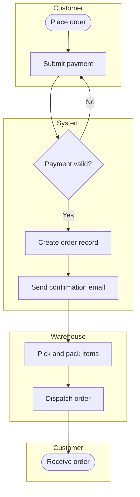

# Week 4 — BPMN Basics & Gherkin Acceptance Criteria Practice

## 1. BPMN (Business Process Model and Notation) Basics

Core symbols learned this week:

| Symbol | Meaning |
|---|---|
| Rounded rectangle | Task / activity |
| Diamond | Gateway (decision point) |
| Circle (thin border) | Start event |
| Circle (thick border) | End event |
| Arrow | Sequence flow |
| Swimlane | Groups tasks by the role/department responsible |

## 2. Practice BPMN Diagram — Order Fulfilment (with swimlanes)



**Note:** swimlanes make it clear which role owns each step — useful when a BA needs to
identify handoff points where delays or miscommunication commonly occur.

## 3. Gherkin Acceptance Criteria Practice (Given-When-Then)

Extra scenarios written as practice, building on the single scenario in the main
Week 4 notes file.

```gherkin
Feature: My Orders page

  Scenario: Customer views their order history
    Given I am logged in as a registered customer
    When I navigate to the "My Orders" page
    Then I should see a list of my past orders sorted by date, most recent first

  Scenario: Customer with no orders sees an empty state
    Given I am logged in as a registered customer with no past orders
    When I navigate to the "My Orders" page
    Then I should see the message "You have no orders yet"

  Scenario: Customer cannot view another customer's orders
    Given I am logged in as Customer A
    When I attempt to open an order detail URL belonging to Customer B
    Then the system should deny access and show an error message

  Scenario: Order list handles a large number of orders
    Given I have more than 50 past orders
    When I navigate to the "My Orders" page
    Then the page should load within 2 seconds
    And the orders should be paginated in groups of 20
```

## 4. Key Takeaway
Gherkin forces requirements into a testable, unambiguous format — writing the
"negative" and "edge case" scenarios (no orders, unauthorized access, large data volume)
was more valuable practice than the "happy path" scenario alone, since those are the
cases most often missed in real requirements documents.
