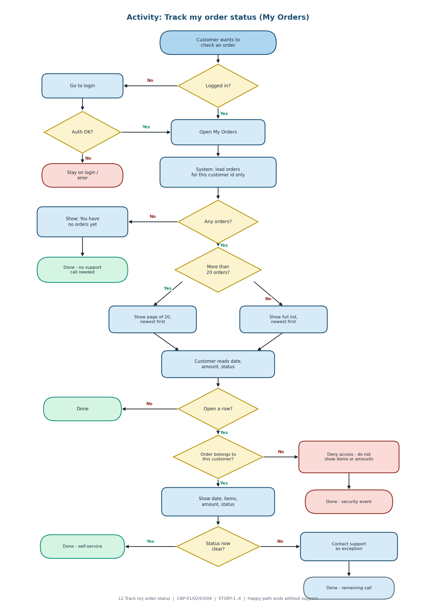
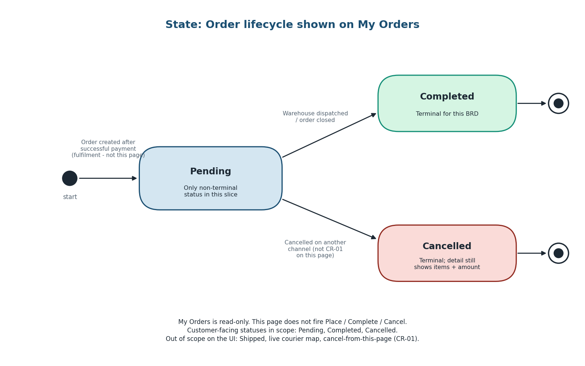
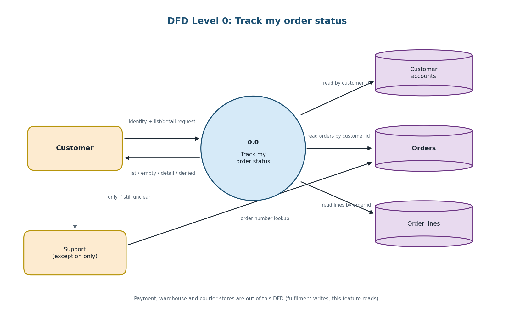
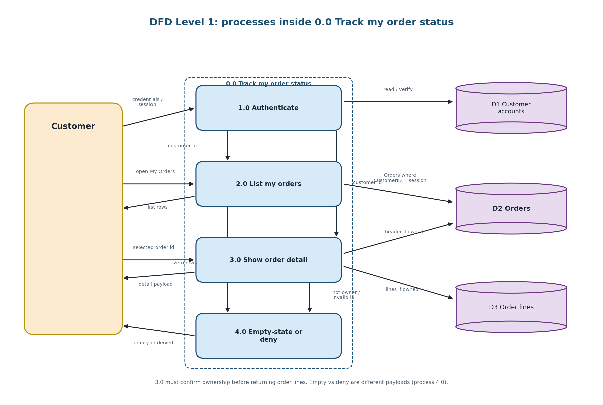

# Week 6 — Advanced Diagrams (Activity, State, DFD)

Three behaviour / information diagrams for **Customer Order Tracking Enhancement**.

These are **not** a redraw of the Week 4 fulfilment BPMN. That diagram is L2
**Place and fulfil order**. This pack is L2 **Track my order status** plus the
order object's allowed statuses and the data that moves when Priya opens My Orders.

**Author:** Jianlong Jeremy Chen (s392088)  
**Images:** PNG files in `diagrams/` (these render in GitHub, VS Code and Word).  
**Source:** matching `.mmd` files if you need to edit the logic later.

| Diagram | PNG (opens in preview) | Question it answers |
|---|---|---|
| Activity | [activity_my_orders.png](diagrams/activity_my_orders.png) | What L3 steps and exceptions happen when a customer checks status? |
| State | [state_order_lifecycle.png](diagrams/state_order_lifecycle.png) | Which statuses may appear on the list/detail (Pending, Completed, Cancelled)? |
| DFD Level 0 | [dfd_order_tracking_l0.png](diagrams/dfd_order_tracking_l0.png) | Context: who talks to the process, which stores exist? |
| DFD Level 1 | [dfd_order_tracking.png](diagrams/dfd_order_tracking.png) | What data moves between customer, processes and stores? |

---

## 1. Activity diagram — "Track my order status"

**Type:** UML activity diagram.  
**Process level:** L2 *Track my order status*; nodes are L3 tasks from
`Week6_Business_Elements.md`.  
**Actors:** Customer (Priya) and System. Support is an exception exit, not the happy path.

**What to notice**

- Not logged in → login, then resume. Do not show anyone else's orders.
- Zero orders → empty-state (STORY-3 / FR-04). Sprint 1 may still show a blank list;
  the diagram shows the *intended* To-Be so Dev/QA know the gap.
- Large list → paging (STORY-4 / NFR-01), Sprint 2.
- Open detail is CAP-02 (STORY-2). Direct URL to another customer's order is CAP-03
  (UAT-05): deny and stop — do not render line items.
- If status is still unclear after detail, Priya may call support. Success for BO-1
  is that this path is rare.

**Links:** CAP-01 / CAP-02 / CAP-03 / CAP-04 · STORY-1…4 · UAT-01…05

---

## 2. State diagram — order lifecycle (statuses on My Orders)

**Type:** UML state machine.  
**Object:** one `Order`.  
**BRD constraint:** the customer-facing statuses in scope are **Pending**,
**Completed** and **Cancelled**. Courier tracking, Draft cart, Shipped-as-a-label,
and CR-01 cancel-from-this-page are out of scope for the UI, but Cancelled can
still *appear* if cancellation happened on another channel.

**What to notice**

- My Orders is **read-only**. The page does not fire Place / Complete / Cancel
  transitions; it only *displays* the current state.
- Pending is the only non-terminal state in this slice. Completed and Cancelled
  do not move further in Sprint 1–2.
- Invalid for this product: showing "Shipped" or a live map (explicitly out of
  scope). If Dev invents extra statuses, the BRD and this diagram must be updated
  together.

**How testers use it:** UAT-01 expects #101 Completed, #104 and #109 Pending.
There is no seeded Cancelled row in Week 5 data — if QA add one, it must stay
Cancelled and still be hidden from Customer B (UAT-05).

---

## 3. Data flow diagrams — order tracking

**Type:** Yourdon / DeMarco style DFD (external entity, process, data store).  
**Level 0** is the context: one process, the customer, and stores.  
**Level 1** splits that process so Dev and DA can see which store is read.

Arrows are **data**, not control. Login UI chrome is omitted except as
customer identity in, because CAP-03 depends on it.

### 3.1 Level 0 — context

### 3.2 Level 1 — processes inside 0.0

| Process | Capability | Store | Notes for Dev / DA |
|---|---|---|---|
| 1.0 Authenticate | CAP-03 | Customer accounts | Session → customer id; no id, no orders |
| 2.0 List my orders | CAP-01, CAP-04 | Orders | Filter by customer id; sort `OrderDate` desc; page 20 in Sprint 2 |
| 3.0 Show order detail | CAP-02, CAP-03 | Orders + Order lines | Confirm ownership **before** returning lines |
| 4.0 Empty-state / deny | CAP-01 / CAP-03 | — | Empty message vs access denied — different payloads, both valid |

**Out of DFD on purpose:** payment gateway, warehouse scan events, courier APIs.
Those belong to fulfilment. This feature **reads** `Orders` / lines created
elsewhere (Week 4 constraint: reuse existing table, no schema redesign).

---

## 4. How the three diagrams work together

| If you look at… | You should also look at… |
|---|---|
| Activity diamond "Order belongs to this customer?" | DFD 3.0 ownership check + RTM UAT-05 / CAP-03 |
| Activity "Show: You have no orders yet" | DFD 4.0 empty payload + STORY-3 / FR-04 |
| State "Pending / Completed / Cancelled" | List columns FR-02 and detail FR-03 — no extra status values |
| DFD "Read orders by customer id" | Activity "load orders for this customer id only" |

Week 4 BPMN still stands for **creating** the order that this DFD **reads**.

---

## 5. Key Takeaway

Activity = L3 tasks and exceptions. State = which values FR-02/FR-03 may show.
DFD = which data moves and which store is authoritative. Together they stop Dev
implementing a fulfilment workflow on a read-only page, and stop DA exposing
unfiltered `SELECT * FROM Orders`.
