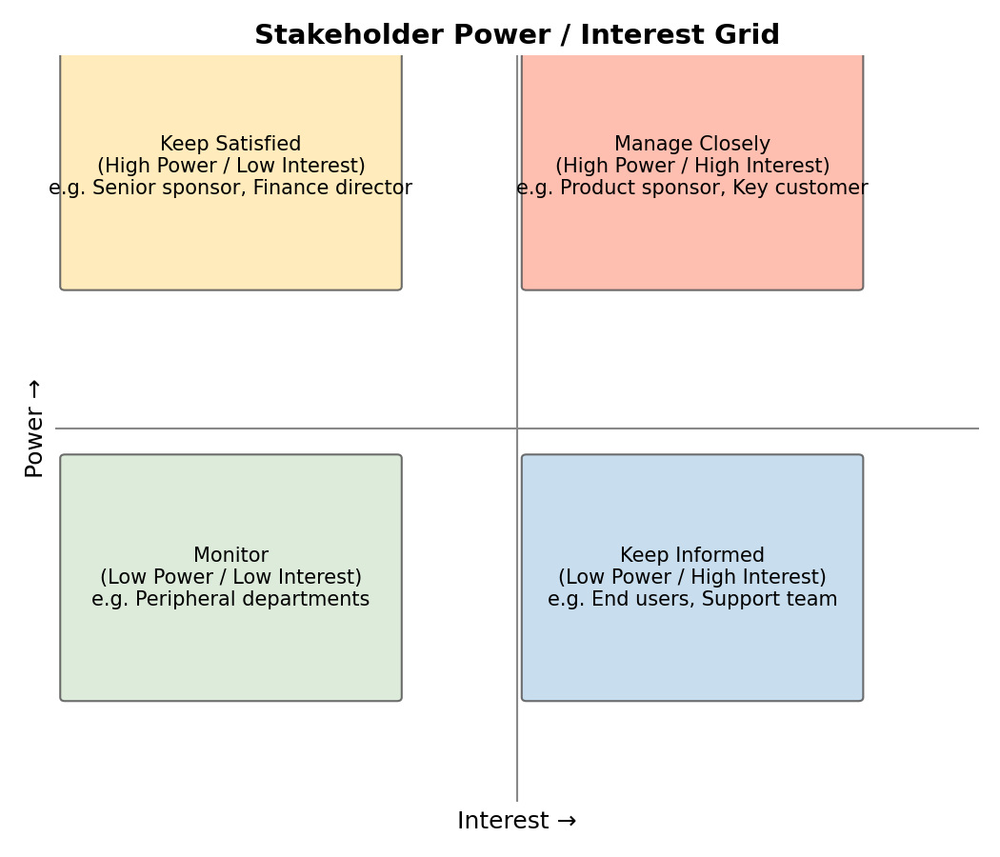

# Course Notes: Business Analysis — Managing Stakeholder Expectations

## 1. Why manage stakeholder expectations

A business analyst spends most of their time not writing documents, but **aligning different people's views on what should and shouldn't be done**. Poor stakeholder expectation management commonly leads to:

- Uncontrolled scope creep
- Key decision-makers discovering late that direction is wrong, forcing rework
- Teams caught between conflicting demands

Core goal: **identify all relevant parties early → understand their needs and influence → communicate with them in the right way and frequency → continuously manage expectation gaps.**

## 2. Stakeholder Identification

Common methods:
- Review existing documentation (org charts, project charters)
- Run workshops / brainstorms
- Map business processes and see who appears in them
- Interview relevant departments directly

Common stakeholder categories:
- **Decision-makers**: project sponsor, executives
- **Doers**: development team, QA team
- **Affected parties**: customers, end users, customer support, suppliers
- **Regulatory/compliance**: legal, audit, industry regulators

## 3. Power-Interest Grid

This is the most widely used stakeholder classification tool. It plots stakeholders by **power (influence)** and **interest (level of concern)** into four quadrants, which then determines the communication strategy:

| Quadrant | Strategy |
|---|---|
| High Power / High Interest (Manage Closely) | Frequent, in-depth communication; involve them in key decisions |
| High Power / Low Interest (Keep Satisfied) | Regular briefings, so they don't step in disruptively due to lack of information |
| Low Power / High Interest (Keep Informed) | Stay transparent, share progress promptly to avoid anxiety or misunderstanding |
| Low Power / Low Interest (Monitor) | Minimal communication effort, but don't ignore them entirely |

> Tip: Place stakeholders where they **actually are**, not where you wish they were. The grid changes as the project progresses and should be revisited regularly.

## 4. Building a Communication Plan

For each stakeholder group, clarify:
1. **What** to communicate (content/level of detail)
2. **How often** to communicate (frequency)
3. **What channel** to use (email / meeting / dashboard / instant messaging)
4. **Who** owns the communication

A simple communication plan table:

| Stakeholder | Quadrant | Content | Frequency | Channel |
|---|---|---|---|---|
| Project sponsor | Manage Closely | Milestones, risks, decision requests | Weekly | 1:1 meeting |
| Customer support | Keep Informed | Feature changes, release timing | Bi-weekly | Email digest |
| Supplier | Keep Satisfied | Key dependency milestones | As needed | Email |

## 5. RACI Matrix (Supporting Tool)

Clarifies who is responsible for what, avoiding "I thought someone else was doing this":

- **R**esponsible: the person who actually does the work
- **A**ccountable: the person ultimately answerable for the outcome (usually one person)
- **C**onsulted: people whose input is needed beforehand
- **I**nformed: people who need to be told after the fact

## 6. Practical Tips for Managing Expectation Gaps

- **Align on "done" early**: different stakeholders can have wildly different standards for what "done" means
- **Visualize progress**: use boards/roadmaps instead of long written reports to reduce misreading
- **Deliver bad news early**: delaying bad news only amplifies stakeholder dissatisfaction
- **Distinguish "want" from "need"**: a stakeholder's proposed solution isn't the same as the underlying business problem — a BA's job is to dig out the root cause

## Summary

| Step | Output |
|---|---|
| 1. Identify stakeholders | Stakeholder list |
| 2. Analyze power/interest | Power/interest grid |
| 3. Build communication plan | Communication plan table |
| 4. Track continuously | Regularly updated expectation-gap log |

**Recommended videos** (free, shareable):
- Stakeholder Analysis: Interest-Power Grid — https://www.youtube.com/watch?v=3IeEe29jQIo
- Stakeholder Analysis: Power Interest Grid Explained with PMP Exam Tips — https://www.youtube.com/watch?v=dP_26LxUDY8
