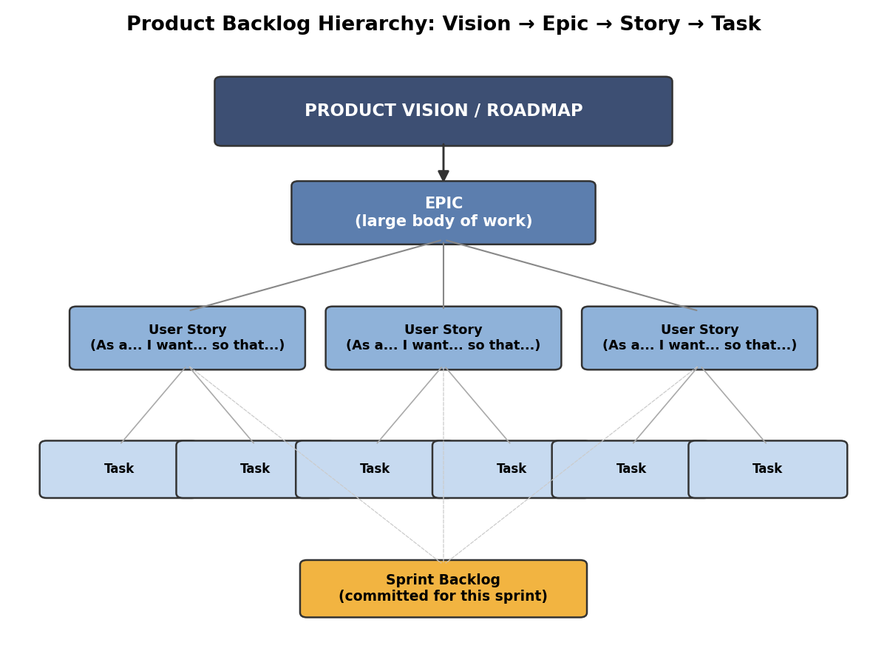
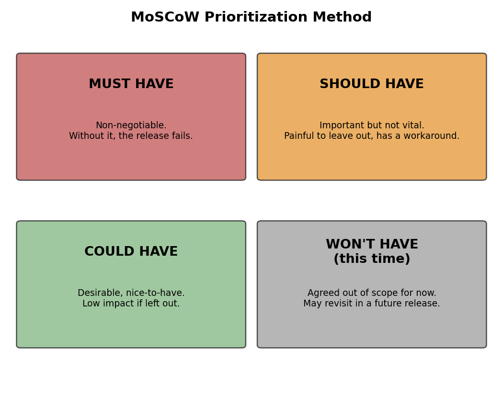
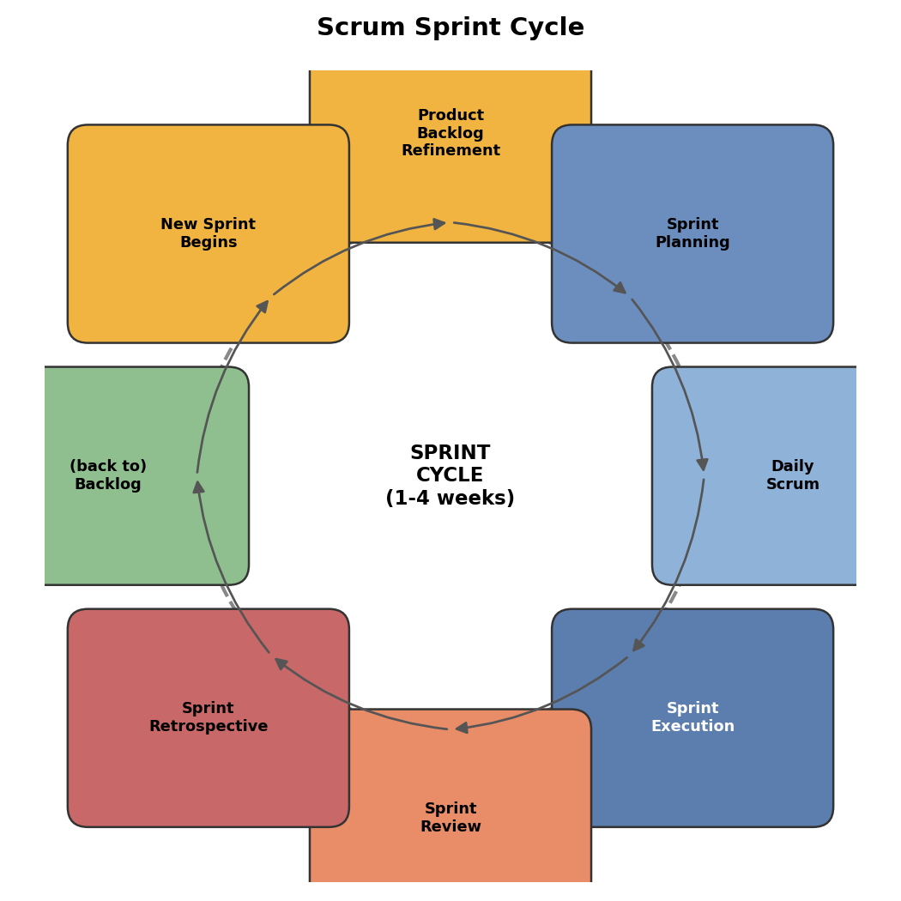

# Course Notes: Agile Product Owner — Managing the Product Backlog

## 1. What is a Product Backlog

The Product Backlog is the **single, ordered** list of all outstanding work for a product — new features, improvements, bug fixes, technical debt, and more. It's the Product Owner's (PO) core artifact: not just a task list, but a **communication tool** that aligns the team and stakeholders on what to do next and why.

Key characteristics:
- **Dynamic**: items can be added, removed, or changed at any time
- **Ordered**: the most important items sit at the top
- **Single source of truth**: there should never be multiple versions of "the backlog"

## 2. Backlog Hierarchy: Vision → Epic → Story → Task



- **Product Vision / Roadmap**: the top level, answering "what kind of product are we building"
- **Epic**: large-grained work spanning multiple sprints, e.g. "improve the checkout flow"
- **User Story**: a small-grained requirement broken out of an epic, completable within one sprint
- **Task**: a specific technical work item broken out of a story, usually assigned to one developer

### User Story format

```
As a [type of user],
I want [to do something],
so that [I get some value/benefit].
```

Example:
> As a registered user, I want to save frequently used shipping addresses, so that I don't have to re-enter them on my next order.

### INVEST criteria (is this story "good enough"?)

| Letter | Meaning |
|---|---|
| I | Independent — should not depend heavily on other stories |
| N | Negotiable — details can still be discussed and adjusted |
| V | Valuable — meaningful to the user/business |
| E | Estimable — the team can gauge the effort |
| S | Small — small enough to finish within one sprint |
| T | Testable — has clear acceptance criteria |

## 3. Prioritization Methods

### MoSCoW Method



- **Must have**: without it, the release fails / is illegal / is unsafe
- **Should have**: important, but has a workaround
- **Could have**: nice-to-have, low impact if left out
- **Won't have this time**: out of scope for now, may be revisited later

### Other common methods (good to know)

| Method | Core idea | When to use |
|---|---|---|
| Kano Model | Distinguishes "basic / performance / delight" features | When you need to understand emotional user response |
| WSJF (Weighted Shortest Job First) | Ranks by "cost of delay ÷ job size", common in SAFe | When there are many dependencies and you need quantified decisions |
| RICE | Reach × Impact × Confidence ÷ Effort | When comparing priorities across teams |
| Stack Ranking | Team/stakeholders manually rank items | Small teams, small backlogs |

> Practical tip: you don't need to master every method — pick 1-2 and align with your team/stakeholders. **What matters is that the ranking process is transparent and explainable**, not the tool itself.

## 4. Backlog Refinement (Grooming)

- An ongoing activity, not a one-time meeting — plan for 1-2 sessions per sprint
- Goal: get the top items to meet the **Definition of Ready (DoR)** — the team understands them, can estimate them, and they have acceptance criteria
- Participants: PO leads, developers and Scrum Master weigh in on feasibility and effort

## 5. Where the Backlog Fits in the Sprint Cycle



A sprint (typically 1-4 weeks) cycle:
1. **Backlog Refinement**: ongoing, ensures the next sprint has "Ready" stories
2. **Sprint Planning**: select high-priority stories from the Product Backlog to form the Sprint Backlog
3. **Daily Scrum**: daily stand-up to sync progress and blockers
4. **Sprint Execution**: the team completes the work
5. **Sprint Review**: demo outcomes, gather feedback
6. **Sprint Retrospective**: reflect on process, drive continuous improvement

## 6. The PO's Role in Prioritization

| Role | Focus |
|---|---|
| Product Owner | Balances stakeholder needs, user value, and business goals; makes the final ranking decision |
| Scrum Master | Facilitates the prioritization discussion, removes process blockers |
| Development team | Provides feasibility and effort estimate input |
| Stakeholders | Provide business value and strategic priority input |

## Summary

A healthy Product Backlog should:
- Have its top items already refined enough to enter a sprint directly (Ready)
- Get coarser in granularity further down (since priorities may still shift)
- Be refined regularly, avoiding "junk drawer" style growth

**Recommended video** (free, shareable):
- Jira Full Course Tutorial (includes backlog walkthrough) — https://www.youtube.com/watch?v=wfx8MFrffjo
- Agile Scrum Model - https://www.youtube.com/watch?v=SWDhGSZNF9M
