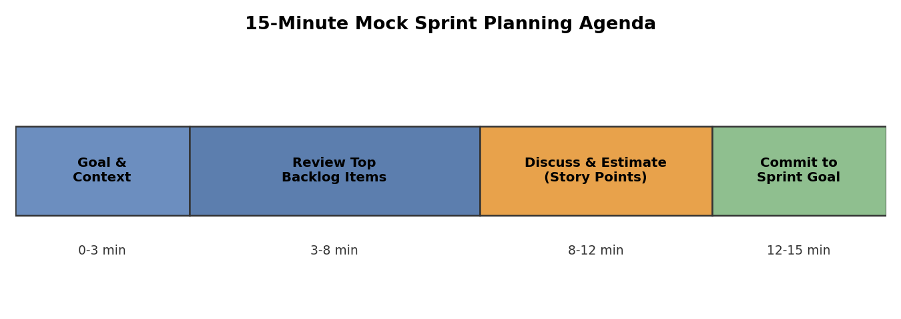

# Practice Task Walkthrough
### Build a Mock Backlog for Your Week 1 Feature in Free Jira + Run a 15-Minute Mock Sprint Planning Session

Original task:
> Create a mock backlog in a free Jira board for your Week 1 feature — write epics, break into stories, prioritize, and run a 15-min mock sprint planning session (record yourself or present to a friend).

## Step 1: Sign up for free Jira (5 min)

1. Go to https://www.atlassian.com/software/jira/free and create a free account
2. Create a new project: choose the **Scrum** template, **Team-managed** type
3. Suggested project name: `Week1-Feature-Practice`

## Step 2: Decide on your "Week 1 feature" scope (10 min)

If you don't have a specific feature topic yet, pick something small and familiar to practice with, e.g.:
- A **task reminder feature** for a to-do app
- A **cart coupon feature** for an e-commerce site
- A **login and permissions feature** for an internal system

> Pick a small but complete feature so you can cover it fully within 15 minutes.

## Step 3: Write Epics (15 min)

In the Jira Backlog page, create 1-2 epics. Example (using a "task reminder feature"):

- **Epic 1: Core Reminder Functionality** — let users set a reminder for a task and get notified on time
- **Epic 2: Reminder Channels & Personalization** — let users customize how and how often they get reminded

## Step 4: Break Down into User Stories (20 min)

Under each epic, write 3-5 stories in the standard format:

**Epic 1: Core Reminder Functionality**
1. As a user, I want to set a reminder time for a task, so that I don't miss the deadline.
2. As a user, I want to receive an in-app notification when the reminder time arrives, so that I can act on the task promptly.
3. As a user, I want to edit or cancel a reminder I've already set, so that I can adapt to changing plans.

**Epic 2: Reminder Channels & Personalization**
4. As a user, I want to receive reminders via email or SMS, so that I still get notified without opening the app.
5. As a user, I want to set "how far in advance" to be reminded (e.g. 30 minutes / 1 hour before), so that I can plan on my own schedule.

Attach acceptance criteria to each story, e.g. for Story 1:
- The user can pick a date and time as the reminder point when creating/editing a task
- The reminder time cannot be earlier than the current time
- Once saved, the set reminder is visible in the task detail view

## Step 5: Enter and Link Stories in Jira (15 min)

1. Backlog page → Create epic → create Epic 1 and Epic 2
2. Create issue → set Issue Type to Story → fill in the title → link it to the corresponding epic via Epic Link
3. Fill in acceptance criteria in the description field
4. Estimate each story with a Story Point (e.g. 1/2/3/5/8)

## Step 6: Prioritize (10 min)

Use MoSCoW to tag each story (using Jira's Label feature):

| Story | Priority |
|---|---|
| Set reminder time | Must |
| In-app notification | Must |
| Edit/cancel reminder | Should |
| Email/SMS reminder | Could |
| Custom lead time | Could |

Once tagged, **drag and reorder** the stories in the Backlog view, with Must-haves at the top.

## Step 7: Create a Sprint and Add Top-Priority Stories (5 min)

1. On the Backlog page, click **Create sprint**
2. Drag the top 2-3 ranked stories into the sprint
3. Set the sprint name and a Sprint Goal, e.g.:
   > Sprint Goal: Enable users to set task reminders and receive in-app notifications on time

## Step 8: Run a 15-Minute Mock Sprint Planning Session (record it or present to a friend)

### Meeting script template

**Opening (0-3 min): Goal & background**
> "Hi everyone, today we're planning the sprint for the 'task reminder feature.' The goal is to let users set reminders for tasks and get notified on time. The background is that user feedback showed many people miss deadlines because they forget to check the app."

**Review the backlog (3-8 min): Walk through epics and stories**
> "We've split this feature into two epics: core reminder functionality and personalization settings. This sprint we're focusing on the core functionality, which includes these three stories: setting a reminder time, in-app notifications, and editing/canceling reminders. They're all Must-haves — essential for this release."
(Walk through each story's acceptance criteria)

**Discussion & estimation (8-12 min): Story points**
> "Now let's talk about effort. 'Set reminder time' involves UI changes and data storage, so let's estimate 3 points. 'In-app notification' involves a backend scheduled job and is more complex, so 5 points. 'Edit/cancel reminder' builds on existing UI, so 2 points. That's 10 points total, in line with our team's average velocity."

**Commit to the sprint goal (12-15 min)**
> "Based on this discussion, we're committing to completing these three stories in this two-week sprint, achieving the goal: users can set reminders and receive in-app notifications on time. If anything blocks us, we'll surface it in daily stand-ups."

### Recording tips

- Use your phone or screen-recording software (e.g. OBS, QuickTime, Windows Game Bar) to record your screen while narrating
- Keep the whole thing to around 15 minutes — you don't need to read verbatim, just follow the script's structure naturally
- If presenting to a friend, have them play a "team member" and ask 1-2 questions (e.g. "why did you estimate this story at 5 points?") to make it feel more realistic

## Deliverables Checklist

By the end, you should have:
- [ ] A Jira project with at least 2 epics
- [ ] 3-5 stories per epic, each with acceptance criteria and a story point estimate
- [ ] Priorities set using MoSCoW (or another method)
- [ ] A created and started sprint with 2-3 top-priority stories
- [ ] A ~15-minute recording/walkthrough (mock sprint planning session)
