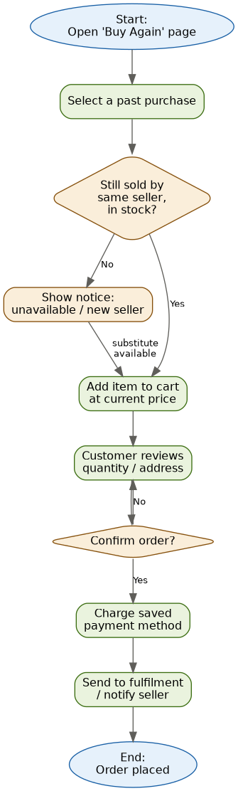

# Practice: BPMN Flowchart + SQL Queries (Amazon — Buy It Again)

## 1. BPMN flowchart — "Buy It Again" process



**Walkthrough of the diagram, tying back to the Week 1 business rules:**
- **Open 'Buy Again' page → Select a past purchase** — matches US1/US2 from Week 1; only eligible items (delivered, not on an active Subscribe & Save) reach this list.
- **Decision: still sold by same seller, in stock?** — this single gateway actually collapses two separate business rules for diagram-readability: (1) is the exact variant still sold at all (US2), and (2) is it still the *same* seller (US3). In a Level 2 diagram these would be two separate gateways, since a "Yes" to availability but "No" to same-seller should show the seller notice without blocking the purchase — the "substitute available" path in the diagram represents exactly that case.
- **Add item to cart at current price** — implements the "always current price, never historical" rule; the >15% price-increase notice (US4) is a display-logic detail inside this step, not a separate branch, the same reasoning that applies to any repurchase flow with live pricing.
- **Customer reviews quantity / address ⇄ Confirm order?** — this loop implements US5 (explicit address/payment confirmation) and US6 (quantity adjustment); looping back on "No" means the customer can revise as many times as needed.
- **Charge saved payment method → Send to fulfilment / notify seller → End** — final steps. Not shown separately: a failed payment sub-flow, and — specific to this domain — what happens if the *now-different* seller can't actually fulfil to the customer's address (a real Amazon edge case that a Level 2 diagram would need its own gateway for).

This is a **Level 1 process diagram** — enough to align the team on overall shape and check it against the user stories, not a full implementation spec. The seller-change and price-change logic in particular need a Level 2 diagram with proper swimlanes (Customer / App / Catalogue Service / Seller / Payment) before a developer could build directly from it.

## 2. SQL queries — Northwind sample database

Task instructions specified using a free sample database (Northwind) rather than live Amazon data — which fits this domain unusually well, since Northwind is already a retail/order-fulfilment schema. The tables map onto Amazon's domain almost directly: `Customers` → Amazon accounts, `Orders`/`Order Details` → orders and line items, `Products` → catalogue listings/ASINs, `Employees` → here used as a stand-in for internal account managers (Amazon's real analogue, third-party sellers, isn't represented as a separate entity in Northwind). Each query below answers a real business question a BA would be asked when scoping a repurchase feature.

Assumes standard Northwind tables: `Customers`, `Orders`, `Order Details` (Quantity, UnitPrice, Discount), `Products`, `Employees`.

**Q1 — Top 5 customers by total order value**
*Business question: "Who are our highest-value repeat customers, and are they the ones most likely to benefit from a faster repurchase path?"*
```sql
SELECT TOP 5
    c.CustomerID,
    c.CompanyName,
    SUM(od.UnitPrice * od.Quantity * (1 - od.Discount)) AS TotalOrderValue
FROM Customers c
JOIN Orders o ON o.CustomerID = c.CustomerID
JOIN [Order Details] od ON od.OrderID = o.OrderID
GROUP BY c.CustomerID, c.CompanyName
ORDER BY TotalOrderValue DESC;
```
*How a BA would use this:* validates the Week 1 business case directly — if this segment's orders skew toward the same few products repeated over time, that's the strongest evidence "Buy Again" targets the right customers.

**Q2 — Products bought more than once by the same customer (the actual "repurchase" signal)**
*Business question: "Which products genuinely get repurchased, as opposed to just being popular overall?" — this is a materially different question from Q2 in a single-purchase analysis, and it's the one that actually matters for scoping this feature.*
```sql
SELECT
    c.CustomerID,
    p.ProductID,
    p.ProductName,
    COUNT(DISTINCT o.OrderID) AS TimesOrdered
FROM Customers c
JOIN Orders o ON o.CustomerID = c.CustomerID
JOIN [Order Details] od ON od.OrderID = o.OrderID
JOIN Products p ON p.ProductID = od.ProductID
GROUP BY c.CustomerID, p.ProductID, p.ProductName
HAVING COUNT(DISTINCT o.OrderID) > 1
ORDER BY TimesOrdered DESC;
```
*How a BA would use this:* this is the query that should have come *first*, not the generic best-seller query — writing it made me realise a plain "best-selling products" query doesn't actually tell you whether a product is repurchased by the *same* customer, only that it sells a lot overall. Those are different business questions, and the BRD's whole premise depends on the second one.

**Q3 — Orders placed per month (trend over time)**
*Business question: "Is repeat-purchase volume trending up or down, and is it seasonal (e.g. spikes for household goods around specific times of year)?"*
```sql
SELECT
    FORMAT(o.OrderDate, 'yyyy-MM') AS OrderMonth,
    COUNT(*) AS NumberOfOrders
FROM Orders o
GROUP BY FORMAT(o.OrderDate, 'yyyy-MM')
ORDER BY OrderMonth;
```
*How a BA would use this:* establishes the baseline trend needed before the Week 1 success metric ("% of eligible customers using Buy Again in a 90-day window") can be judged as an improvement rather than noise.

**Q4 — Customers with no orders in the last 12 months (lapsed repeat-buyers)**
*Business question: "Which past repeat-customers have we lost, and were they exactly the segment this feature is meant to retain?"*
```sql
SELECT
    c.CustomerID,
    c.CompanyName,
    MAX(o.OrderDate) AS LastOrderDate
FROM Customers c
LEFT JOIN Orders o ON o.CustomerID = c.CustomerID
GROUP BY c.CustomerID, c.CompanyName
HAVING MAX(o.OrderDate) < DATEADD(MONTH, -12, GETDATE())
    OR MAX(o.OrderDate) IS NULL;
```
*How a BA would use this:* directly informs the Week 1 business rule "Buy Again only surfaces items from orders in the last 12 months" — this query is effectively how the system decides eligibility, and cross-referencing it against Q2 (repeat-buyers) shows how many *already-loyal* customers lapsed, which is a stronger case for the feature than looking at lapsed customers generally.

**Q5 — Average order value by employee (used here as a proxy for account-manager/region performance)**
*Business question: "Is performance consistent, or are there outliers worth investigating?"*
```sql
SELECT
    e.EmployeeID,
    e.FirstName + ' ' + e.LastName AS EmployeeName,
    AVG(od.UnitPrice * od.Quantity * (1 - od.Discount)) AS AvgOrderLineValue
FROM Employees e
JOIN Orders o ON o.EmployeeID = e.EmployeeID
JOIN [Order Details] od ON od.OrderID = o.OrderID
GROUP BY e.EmployeeID, e.FirstName, e.LastName
ORDER BY AvgOrderLineValue DESC;
```
*How a BA would use this:* Northwind's "Employee" doesn't map cleanly onto Amazon's marketplace model (real sellers aren't Amazon staff) — included as the required query pattern (JOIN + GROUP BY + AVG) rather than a literal metric Amazon would use, and flagged here rather than silently presented as if it were a real Amazon metric.

## Reflection
Writing this exercise exposed a mistake in my first pass: I initially reached for a generic "best-selling products" query (Q2) without checking whether it actually supported the BRD's claim about *repurchase* behaviour. It doesn't — a product can be a best-seller purely on breadth (many different customers buying it once) with zero repurchase behaviour. Q2 above (`COUNT(DISTINCT o.OrderID) > 1` per customer-product pair) is the query that actually tests the premise of the feature, and I only caught the gap by re-reading my own BRD's business need statement against what the query actually measures.
