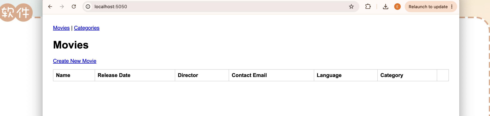
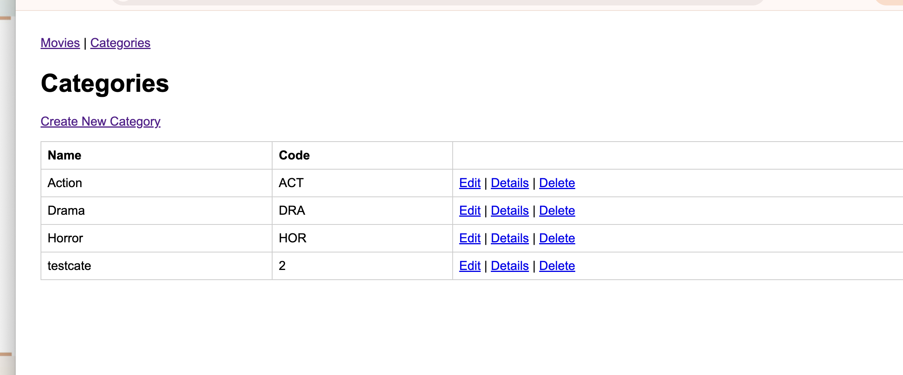
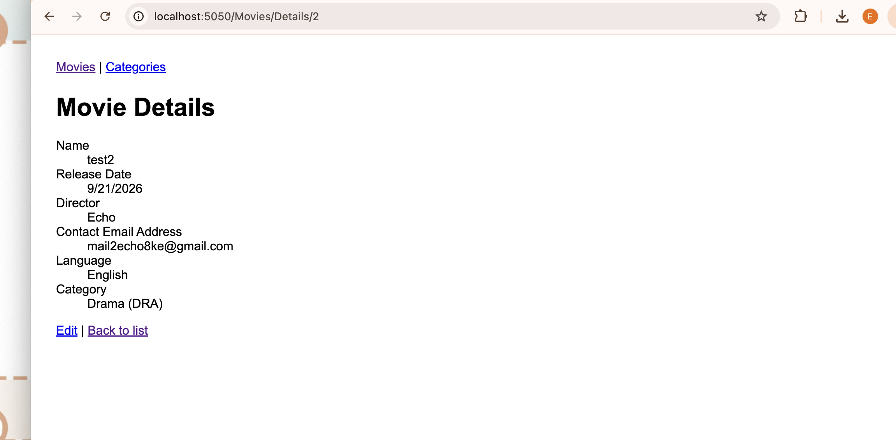
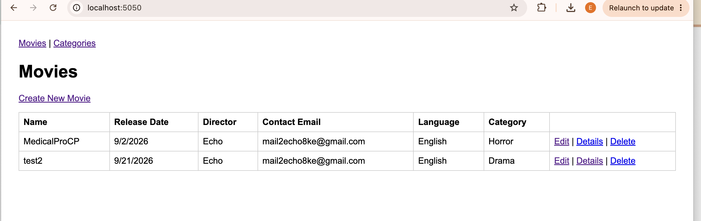

# Theater Admin — Movie & Category Management

A web app for a theater admin to manage movies and categories, built as required:

- **Framework:** ASP.NET Core MVC (chosen over classic ASP.NET Framework MVC because this was
  built on macOS — classic .NET Framework is Windows-only and won't run here at all).
- **Approach:** Code First — the `Movie` and `Category` C# classes in `Models/` are the source
  of truth; EF Core migrations generate the database schema from them.
- **CRUD:** Full Create/Read/Update/Delete for both `Movie` and `Category`, hand-written to match
  the standard output of ASP.NET Core scaffolding (`dotnet-aspnet-codegenerator`) — same
  controller/view structure and naming a scaffolded project would produce.
- **Validation:** Data annotations on the models (`[Required]`, `[EmailAddress]`, `[StringLength]`),
  enforced both client-side (via the validation scripts) and server-side (`ModelState.IsValid`
  checks in every POST action).
- **Database:** SQLite, **not** SQL Express — see "About the database" below.
- **Version control:** Git, with `.gitignore` excluding build output and the local `.db` file.

## Data model

- **Movie**: Id, Name, ReleaseDate, Director, ContactEmail, Language (enum: English/Japanese/Chinese), CategoryId (required FK).
- **Category**: Id, Name, Code. Seeded with three starter rows (Action/ACT, Drama/DRA, Horror/HOR) matching the task's examples.
- A movie **must** have exactly one category — enforced with `[Required]` on `CategoryId` and a non-nullable foreign key in `OnModelCreating`. Categories that still have movies attached can't be deleted (checked in `CategoriesController.DeleteConfirmed`) to avoid violating that rule.
- The category dropdown on the Movie Create/Edit screens is populated via a `SelectList` passed in `ViewData["CategoryId"]` from the controller.

## About the database (important — read before marking this "done")

The task specifies **SQL Express**, which is a Windows-only product and cannot run on macOS.
This project currently uses **SQLite** as a stand-in so the app can be built and run at all —
this was **not confirmed with the teacher/supervisor as an accepted substitute**. Before this is
treated as final, either:
1. Confirm with the teacher/supervisor that SQLite (or SQL Server via Docker) is acceptable, or
2. Run this on a Windows machine/VM with real SQL Express and switch the provider (see below).

**Switching to SQL Server / SQL Express later** only requires:
- Swap the `Microsoft.EntityFrameworkCore.Sqlite` package for `Microsoft.EntityFrameworkCore.SqlServer`
- Change `options.UseSqlite(...)` to `options.UseSqlServer(...)` in `Program.cs`
- Update the connection string in `appsettings.json`
- Delete the `Migrations/` folder and re-run `dotnet ef migrations add InitialCreate` (SQLite and
  SQL Server generate slightly different migration SQL, so migrations aren't portable between them)

## Setup & running locally

```bash
# Restore packages
dotnet restore

# Create the initial Code First migration (generates the Migrations/ folder)
dotnet ef migrations add InitialCreate

# Run the app — this also applies the migration automatically on startup (see Program.cs)
dotnet run
```

Then open the URL shown in the terminal (e.g. `http://localhost:5000`) — it opens directly on
the Movies list.

**Note:** `dotnet ef` requires the EF Core CLI tool. If `dotnet ef` isn't recognised, install it once with:
```bash
dotnet tool install --global dotnet-ef
```

## What "scaffolding" means here

The task asks to "use scaffolding options to create CRUD operations." In Visual Studio on
Windows, this is normally done via the *Add > Controller > MVC Controller with views, using
Entity Framework* wizard, which auto-generates the controller and views from a model class. That
wizard isn't available in this cross-platform setup, so the controllers and views here were
**written by hand to match its standard output** (same action method names — Index/Details/
Create/Edit/Delete — same view structure, same use of `[Bind]` attributes) rather than generated
by the tool itself. Functionally equivalent, but worth being upfront that the actual scaffolding
tool wasn't run.

## Verification

Ran the app locally (`dotnet ef migrations add InitialCreate` then `dotnet run --urls "http://localhost:5050"`, using a different port since 5000 was already in use by another project) and tested the full CRUD flow through the browser:









This confirms: the Code First migration created the schema correctly, the category seed data loaded, the Category dropdown on the Movie Create form works and saves the right foreign key, and both Movie and Category CRUD round-trip through SQLite correctly.
