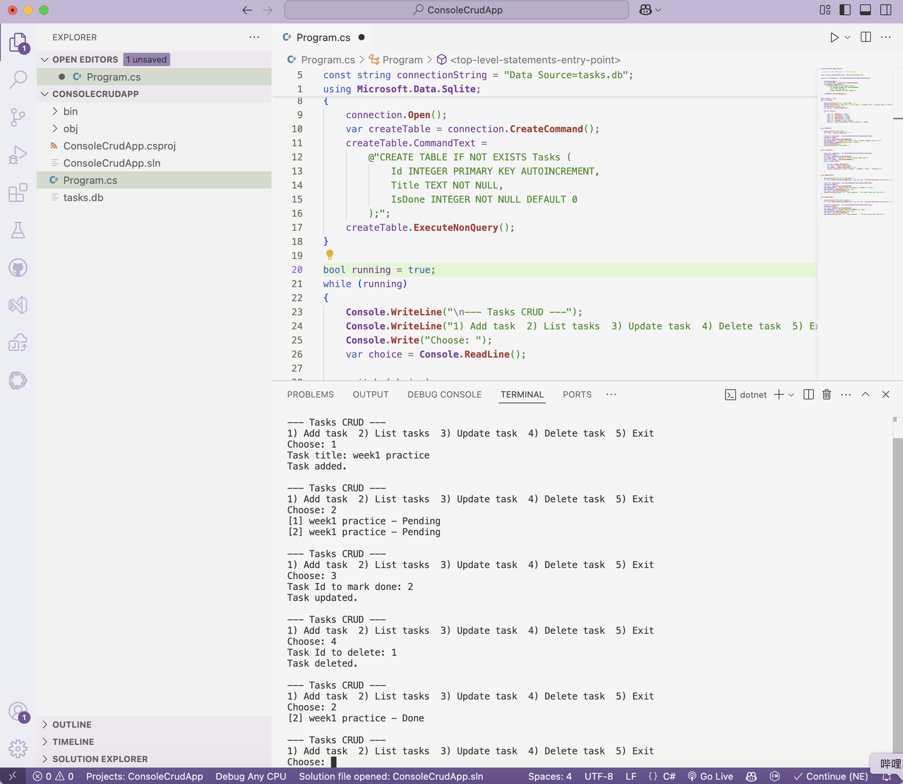

# Week 1 — Language & Backend Foundations (Full Stack .NET Developer)

## Course notes
**C# Essential Training**
- C# is a strongly-typed, object-oriented language; core building blocks are classes, interfaces, properties, and LINQ for querying collections.
- `async`/`await` is the standard pattern for non-blocking I/O (database calls, HTTP calls) instead of blocking threads — not used in the Week 1 console app since SQLite calls here are fast/local, but this becomes essential in Week 2's Web API.
- Nullable reference types (`string?` vs `string`) are used to catch "forgot to check for null" bugs at compile time rather than at runtime — enabled via `<Nullable>enable</Nullable>` in the project file.

**.NET Core Essential Training**
- .NET Core (now just ".NET") is the cross-platform runtime/SDK for building console apps, web APIs, and services on Windows/Linux/macOS.
- Dependency Injection is built into the framework — services are registered once and injected into classes that need them, rather than manually `new`-ed up everywhere. Not needed for a single-file console app, but this is exactly what Week 2's `builder.Services.AddDbContext<...>()` is doing.

**SQL Server Essential Training**
- Relational database using T-SQL; core operations are `SELECT/INSERT/UPDATE/DELETE`, with constraints (PK/FK) enforcing data integrity.
- Connections from .NET typically go through an ORM (Entity Framework Core, used in Week 2) or a lightweight data-access library like ADO.NET/Dapper — this week's app uses raw ADO.NET-style `SqliteCommand` calls deliberately, to understand what EF Core is abstracting away before using it in Week 2.

## Design decisions in the practice app (and why)
- **Validation happens before the database call, not after.** An empty title or a non-numeric Id is a *user input* problem, not a *database* problem — catching it early with `string.IsNullOrWhiteSpace` / `int.TryParse` gives a clear message instead of relying on a SQL constraint violation (which would be a confusing error to show a user).
- **`SqliteException` is caught separately from general exceptions** in the main loop, so a genuine database problem (locked file, corrupt DB) is distinguishable from a user typo — this is a small thing but it's the difference between an app that fails helpfully and one that just crashes.
- **`ORDER BY Id` was added to the list query** after noticing SQLite doesn't guarantee row order without it — a subtle bug that would only show up as "my tasks look randomly ordered" during manual testing.

## Practice deliverable
See `ConsoleCrudApp/` — a C# console app that performs CRUD operations on a simple "Tasks" table, with input validation and basic error handling (not just the happy path). Uses SQLite locally (same relational concepts and T-SQL-style syntax as SQL Server, just file-based so it runs anywhere without a server install) — the data-access code is written so swapping the connection string/provider to SQL Server is a small, isolated change.

## Verification
Ran the app in VS Code and tested all four operations end-to-end (add → list → mark done → delete), confirmed against the terminal output below:

Terminal output confirms: added "week1 practice" (Id 1), listed both existing tasks, marked Id 2 as Done, deleted Id 1, then listed again to confirm Id 2 shows "Done" and Id 1 is gone — all four CRUD operations working against the real `tasks.db` SQLite file.

## What I'd do differently with more time
The data-access code (opening a connection, building a command, adding parameters) is repeated in every method — in a larger app this would be pulled into a small `TaskRepository` class so the SQL is in one place and each menu action just calls a method. Left it inline here since the task scope is a single-file practice exercise, but noted this as the natural next refactor.
