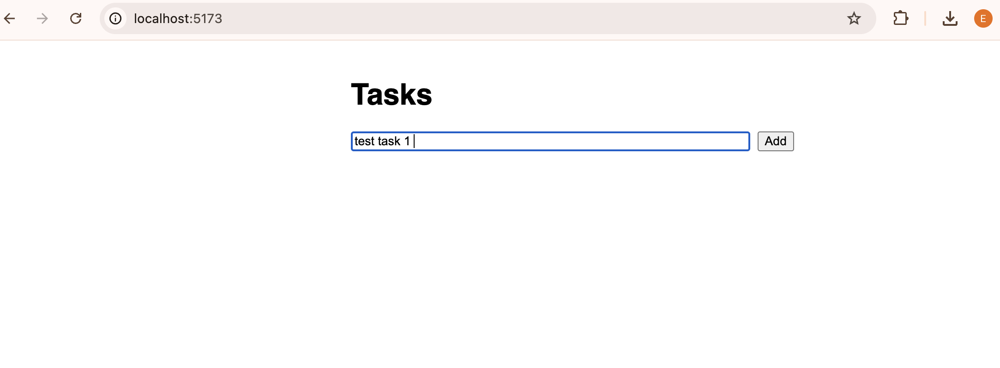
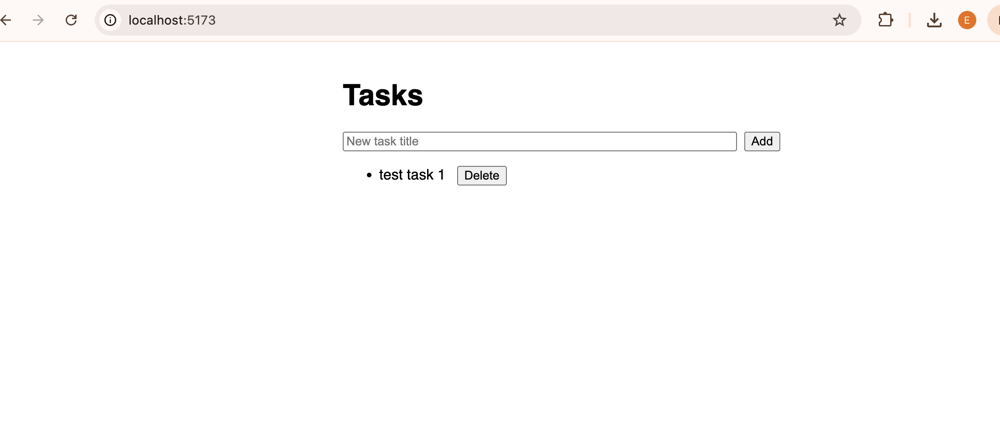

# Week 2 — Web API & Frontend Basics (Full Stack .NET Developer)

## Course notes
**ASP.NET Core: Building RESTful APIs**
- Minimal APIs (or Controllers) map HTTP verbs (GET/POST/PUT/DELETE) to endpoints; each should return proper status codes (200/201/204/400/404) — not just 200 for everything, which is a common beginner mistake that makes client-side error handling impossible.
- Middleware pipeline (`app.Use...`) handles cross-cutting concerns like CORS, error handling, and routing before a request reaches an endpoint.

**Entity Framework Core Essential Training**
- EF Core is an ORM: C# classes ("entities") map to database tables, and `DbContext` tracks changes so `SaveChanges()` generates the right SQL.
- Migrations (`dotnet ef migrations add`) version the database schema alongside the code instead of hand-writing schema changes — not used here since `EnsureCreated()` is sufficient for this practice scope, but noted as the production-correct approach (`EnsureCreated()` and migrations can't be mixed on the same database).

**React.js Essential Training**
- Components are functions that return JSX; `useState` holds local UI state, `useEffect` runs side effects like data fetching on mount.
- Data flows one-way (props down, events up) — a child calls a function passed from the parent to notify it of changes.

## Design decisions in the practice app (and why)
- **The API validates input independently of the frontend.** The frontend checks for a blank title before submitting (good UX — instant feedback), but the API *also* rejects a blank title with a 400. This isn't redundant: the frontend check can be bypassed (a different client, a bug, a malicious request), so the API is the actual source of truth for validity.
- **Every fetch call in the frontend has a try/catch and updates an `error` state**, not just a `console.error`. A console log is invisible to the actual user — if the API is down, the first version of this app would have shown a silently empty task list, which looks like "no tasks exist" rather than "something is broken". That distinction matters for anyone actually using the app.
- **Loading state is tracked explicitly** (`loading` boolean) rather than inferring it from `tasks.length === 0`, because those are two different states: "haven't loaded yet" and "loaded, and there happen to be zero tasks" need different messages, otherwise a slow network makes the empty state flash misleadingly before data arrives.

## Practice deliverable
Turned the Week 1 console CRUD app into a full ASP.NET Core Web API (`TasksApi/`, using Entity Framework Core over SQLite) and a minimal React frontend (`tasks-frontend/`) that lists, adds, and deletes tasks by calling that API — with input validation on both sides and visible error/loading states, not just the happy path.

## Verification
Ran the API (`dotnet run`, listening on port 5000) and the React frontend (`npm run dev`, port 5173) side by side and tested the full add-task flow through the browser, not just via a raw API call:

This confirms the full stack end-to-end: browser input → React state → `fetch` POST to the API → EF Core write to SQLite → API returns the updated list → React re-renders it — not just that each piece compiles in isolation.

## Known limitations (flagged rather than hidden)
- No authentication — anyone who can reach the API can read/write all tasks. Fine for a local practice exercise, not fine for anything real; would need at minimum an API key or JWT auth before this went further.
- The 400/404 error bodies are plain `{ error: "..." }` objects rather than the RFC 7807 "Problem Details" format ASP.NET Core supports natively — a reasonable next step if this were a real project, kept simple here to match the scope of the exercise.
