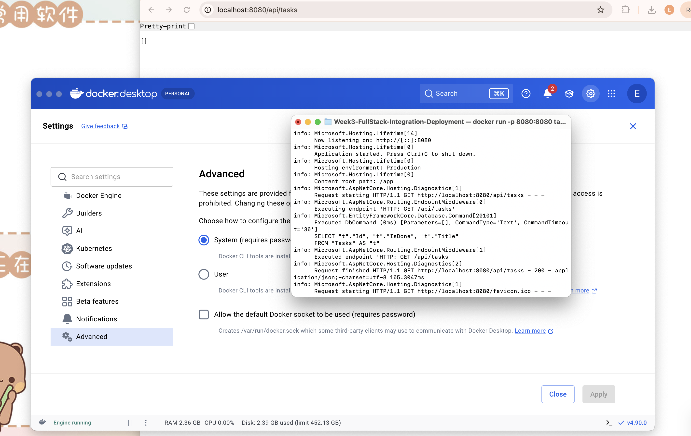

# Week 3 — Full Stack Integration & Deployment (Full Stack .NET Developer)

## Course notes
**ASP.NET Core: MVC**
- MVC separates an app into Model (data), View (Razor templates), Controller (handles requests) — an alternative to the Minimal API style used in Week 2 for apps that render server-side HTML pages rather than serving a JSON API to a separate frontend.
- Routing maps a URL pattern (e.g. `/Tasks/Edit/3`) to a controller action, which returns a View with a model. Not used in this practice app since the React frontend already handles rendering — noted here as a course requirement, distinct from what the app actually needed.

**Learning Docker**
- A container packages the app plus its runtime/dependencies into one portable image, so "works on my machine" problems go away.
- A multi-stage `Dockerfile` (build stage with the full SDK, runtime stage with just the ASP.NET runtime) keeps the final image smaller than shipping the whole SDK — this is the pattern used in this week's Dockerfile, not a single-stage build.
- `docker build` creates the image, `docker run` starts a container from it; `-p 8080:8080` maps the container's internal port to the host so it's reachable from outside.

**Azure Fundamentals (AZ-900 prep)**
- Azure App Service is a PaaS for hosting web apps/APIs without managing servers — you push code or a container image and it handles scaling/patching.
- Core concepts: Resource Groups (logical containers for related resources), regions, and the shared responsibility model (Microsoft manages the underlying infrastructure, you manage your app/data).
- App Settings (environment variables set in the portal) are the standard way to pass secrets/config to an App Service without baking them into the container image — directly relevant to the CORS origin and connection string discussed in this week's README.

## Practice deliverable
See `Dockerfile` (containerises the Week 2 `TasksApi`) and `deployment-README.md` (architecture, run instructions, and — honestly — what's *not* done yet: I documented the Azure/Render deployment steps but haven't actually run through a live deployment, since I'd rather flag that clearly than claim a URL that doesn't exist).

## Verification
Built the image (`docker build -t tasks-api -f Dockerfile ..`) and ran the container (`docker run -p 8080:8080 tasks-api`), then confirmed the containerised API actually serves requests, not just that the build succeeds:

The log confirms `Now listening on: http://[::]:8080`, then a real request/response cycle: `GET http://localhost:8080/api/tasks` → EF Core runs the `SELECT` against SQLite inside the container → `200` response in ~105ms. (The `favicon.ico` 404 visible in the same log is the browser's automatic favicon request, not an application error — expected and harmless for a JSON-only API.)

## Reflection
The most useful part of this week wasn't the Docker syntax itself (which is fairly mechanical once you've seen one multi-stage build) — it was realising how many things quietly break between "runs on my machine" and "runs in a container", specifically: the hardcoded CORS origin, and SQLite's file-based storage not surviving a container restart on most PaaS hosts. Those are the kind of gaps a Business Analyst's requirements document should really call out as non-functional requirements ("must survive a restart", "must be reachable from the production frontend domain") rather than leaving them as implementation details a developer discovers by accident — a useful crossover with the BA-side work I did this week.
