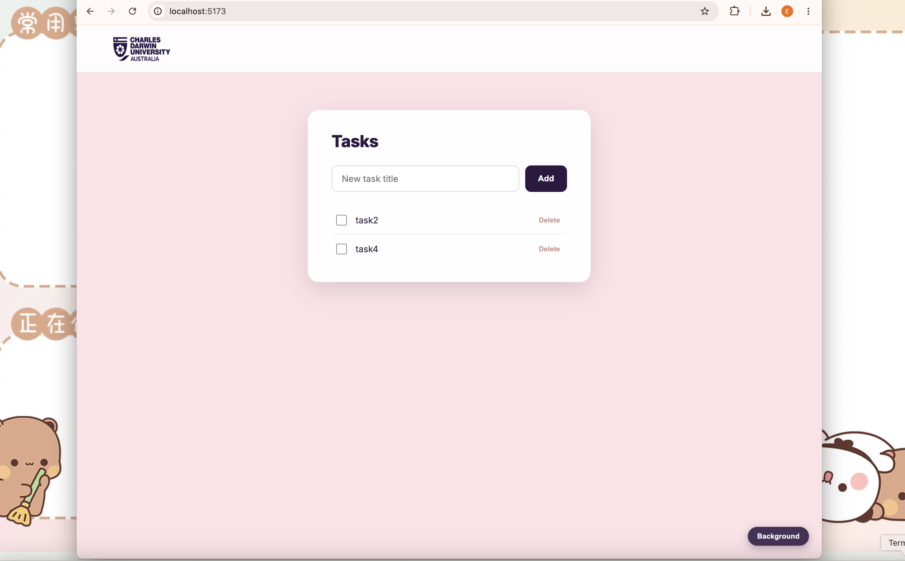

# Week 5 — Setup Instructions

## Prerequisites
- SQL Server running via Docker (same container as Week 4).
- `WeeklyTasksDB` database and `Tasks` table already exist from the Week 4 console app.

## Run the API

```bash
cd TasksApi
dotnet restore
dotnet run
```

Note the port printed in the terminal. If it's not 5000, update `API_URL` at the top of
`tasks-frontend/src/App.jsx` to match.

## Run the frontend

```bash
cd tasks-frontend
npm install
npm run dev
```

Open the printed URL (e.g. `http://localhost:5173`).

## Styling changes
Made some styling changes this time: added the school logo, and you can change the page
background (small button in the bottom-right corner) — upload your own image or keep the default.

