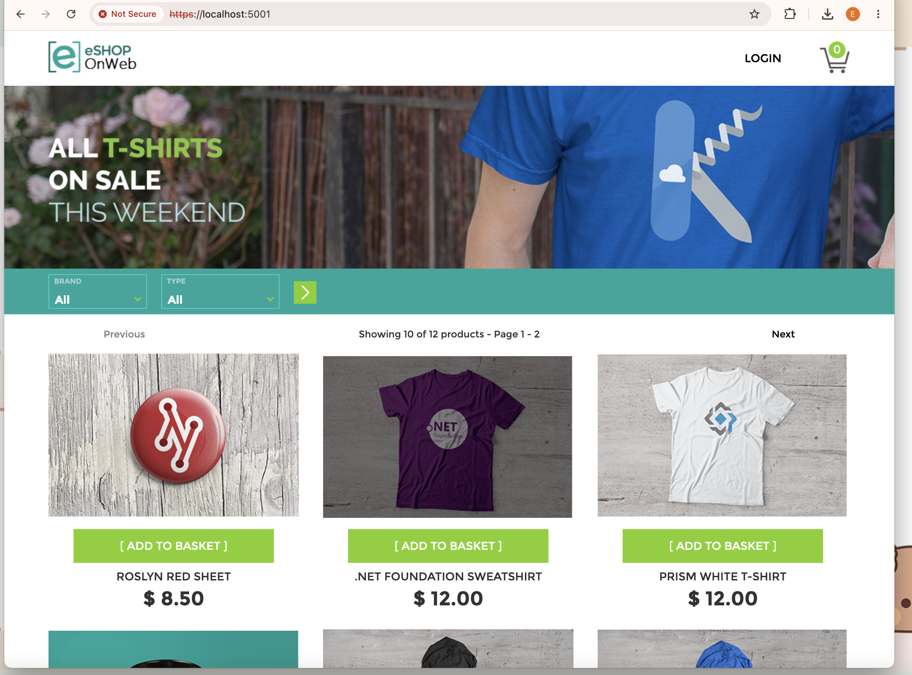

# Week 6 — Research: N-Tier Architecture & Unit Testing

## Context
This week's task was research-only (no specific deliverable format given): "research on n-tier
architecture" and "unit testing." Used **eShopOnWeb** (Microsoft's official ASP.NET Core
reference application — `dotnet-architecture/eShopOnWeb` on GitHub) as the concrete example to
study both topics against, since it's a real, well-documented open-source app that demonstrates
both cleanly, and it ties back to the open-source project research from Week 5.

Got it running locally as a first step (screenshot below), then read through its solution
structure to understand how the architecture is actually organised in a real codebase rather than
just in the abstract.

## N-Tier Architecture

**Core idea:** split an application into separate layers, each with one responsibility, where a
layer only depends on the layer(s) "below" it — never the other way around. "N-tier" is the
general term (n = however many layers a given app uses); "3-tier" (presentation / business logic
/ data access) is just the most common specific case, which is what the Week 5 task's "3-tier
architecture" component option was referring to.

**How eShopOnWeb actually implements this** (from its solution structure, `.sln` file, and the
project's own architecture documentation):

| Project | Layer | Responsibility |
|---|---|---|
| `Web` | Presentation | ASP.NET Core MVC views, Razor Pages, and a public API — the only layer that knows about HTTP requests/responses |
| `ApplicationCore` | Business logic / domain | Domain entities (`Order`, `Basket`, `CatalogItem`, etc.) and business rules — has **no** dependency on EF Core or any database-specific code |
| `Infrastructure` | Data access | EF Core implementation, repositories — implements interfaces that `ApplicationCore` defines |

**The key detail that makes this more than just "three folders":** `ApplicationCore` does not
reference `Infrastructure` at all. Instead, `ApplicationCore` defines interfaces (e.g. a
repository interface), and `Infrastructure` implements them. This is the **Dependency Inversion
Principle** — the business logic doesn't depend on the database implementation; the database
implementation depends on (implements) contracts defined by the business logic. eShopOnWeb's own
docs describe this using an "onion" diagram: business logic at the centre, infrastructure and UI
on the outside pointing inward, never the reverse. This is also referred to as **Clean
Architecture** in their documentation — n-tier layering plus this inward-pointing dependency rule.

**Why this matters practically (not just as a diagram):** if the business logic layer had a
direct reference to EF Core, swapping the database technology (or unit testing the business logic
without a real database) would be much harder. Because `ApplicationCore` only depends on its own
interfaces, tests can substitute a fake/mock implementation instead of the real database — which
is the direct link to this week's second topic.

## Unit Testing

**Core idea:** test one unit of code (typically one method/class) in isolation, without depending
on external systems (database, network, filesystem) — so the test is fast, repeatable, and
failures point precisely at the broken logic rather than an environment problem.

**How eShopOnWeb actually does this:** the solution has a dedicated `UnitTests` project
(separate from `IntegrationTests` and `FunctionalTests` — three different test types, not one
"tests" bucket), using:
- **xUnit** — the test framework (defines `[Fact]`/`[Theory]` test methods, run via `dotnet test`)
- **Moq** — a mocking library, used to create fake stand-in objects for dependencies (e.g. a fake
  repository) so a test can check "does this business logic method behave correctly" without
  touching a real database

**This is exactly where the n-tier structure pays off:** because `ApplicationCore`'s business
logic only depends on interfaces (not concrete `Infrastructure` classes), a unit test can pass in
a **mocked** version of that interface instead of a real EF Core repository. The test then
verifies the business logic's behaviour (e.g. "does adding an item to a basket calculate the
total correctly") without needing a real SQL Server connection at all.

**The three test project types, and why they're separate (not just naming — different scope):**
- `UnitTests` — tests a single class/method in isolation, dependencies mocked (fastest, most numerous)
- `IntegrationTests` — tests how multiple real pieces work together (e.g. an actual EF Core
  context against a real or in-memory database), no mocking of the data layer
- `FunctionalTests` — tests the whole application end-to-end through its actual HTTP endpoints

